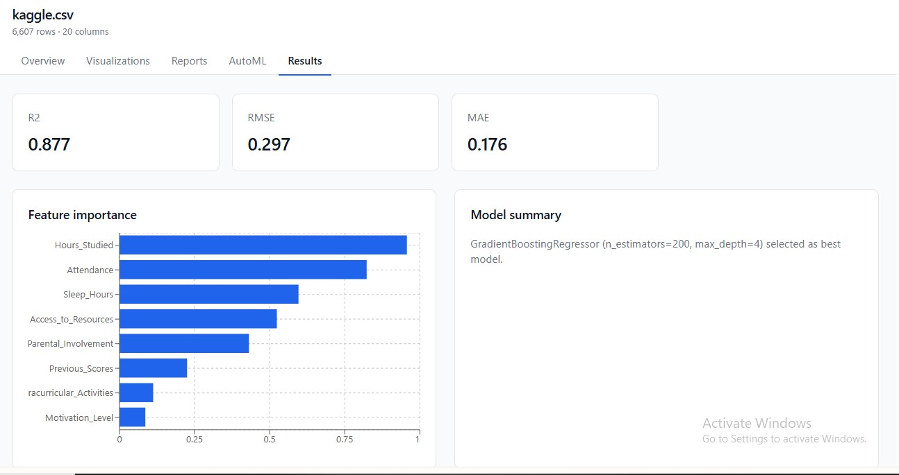
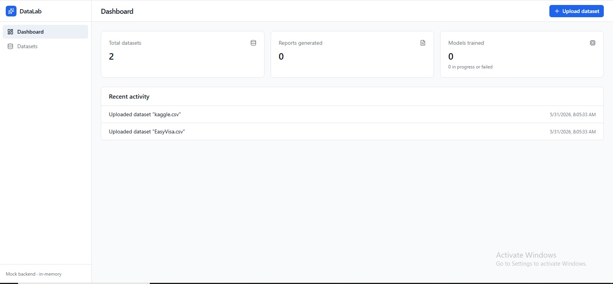
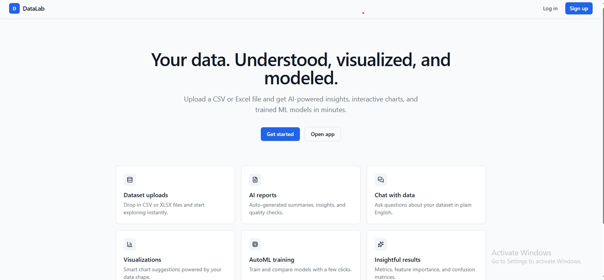
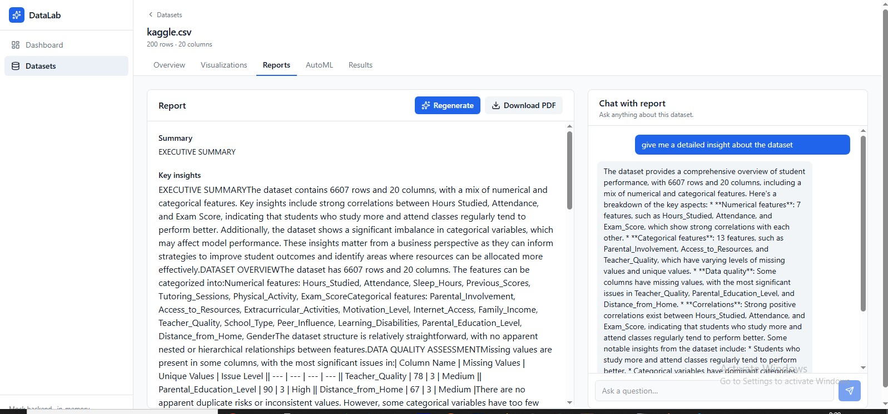
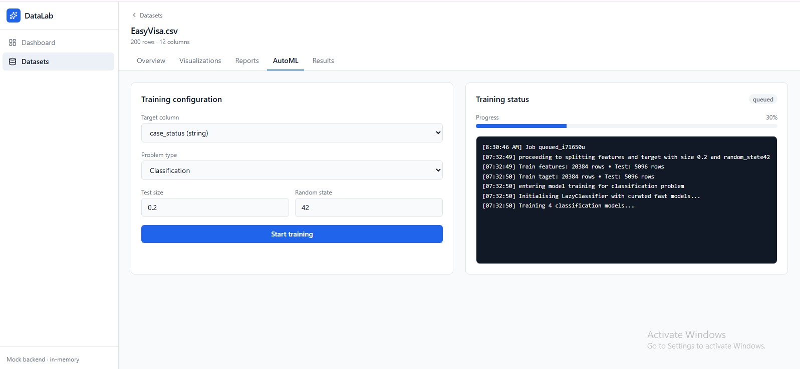
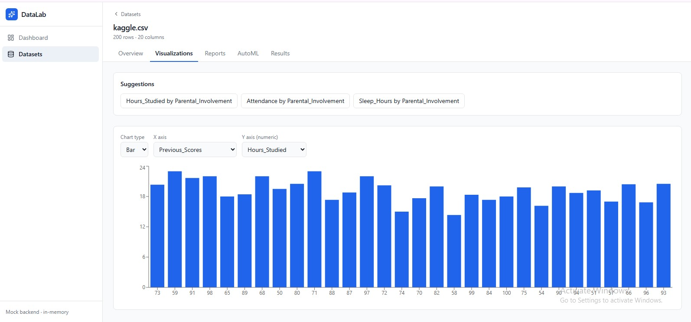

# 🚀 StrakDatalab

StrakDatalab is a web-based data analysis and machine learning platform that enables users to upload datasets and extract meaningful insights with minimal effort.

The platform allows users to:
- Upload `.csv` or `.xlsx` datasets  
- Generate detailed, LLM-powered PDF reports  
- Visualize dataset features  
- Train classical machine learning models with minimal configuration  
- Monitor training in real-time with logging  
- Evaluate model performance using standard metrics  

---

## 📸 Demo

> _Demo screenshot below..._:
Model training result tab:
<p align="center">
  
</p>

Dashboard tab:
<p align="center">
  
</p>

Home page:
<p align="center">
  
</p>

report tab:
<p align="center">
  
</p>

Model training page:
<p align="center">
  
</p>

Visualization_tab:jpg:
<p align="center">
  
</p>


---

## 🔗 Important Links

- 🌐 Live Demo: `https://strakdatalab.vercel.app/`
- 🎨 Frontend Repository: ` https://github.com/LaiTechTinker/strak-lab-front.git`
- ⚙️ Backend Repository: `https://github.com/LaiTechTinker/datagenie`

---

## ✨ Features

- 📊 **Dataset Overview** – Get quick insights into your dataset structure  
- 📈 **Feature Visualization** – Generate simple visualizations for data exploration  
- 🤖 **Auto ML Training** – Train classical ML models with minimal setup  
- 📉 **Model Evaluation** – View performance metrics (accuracy, etc.)  
- 🧠 **LLM Report Generation** – Generate detailed PDF reports powered by LLaMA 3B  
- 📝 **Real-time Logging** – Track model training progress live  

---

## 🛠️ Tech Stack

**Frontend**
- React (Vite)

**Backend**
- Flask (Python)

**Database**
- MongoDB

**Machine Learning**
- Scikit-learn  
- Pandas  
- NumPy  

**AI / LLM**
- LLaMA 3B  

---

## ⚙️ Installation Guide

### 1. Clone the Repositories

#### Frontend
```bash
git clone  https://github.com/LaiTechTinker/strak-lab-front.git
cd strak-lab-front.git
```

#### Backend
```bash
git clone https://github.com/LaiTechTinker/datagenie
cd data_genie
```

---

### 2. Setup Frontend

```bash
npm install
npm run dev
```

---

### 3. Setup Backend

```bash
pip install -r requirements.txt
python app.py
```
*provide your secret keys in the env file
---

## 📁 Backend Folder Structure (Placeholder)

```bash
backend/
│── app.py
│── routes/
│── models/
│── services/
│── utils/
│── requirements.txt
│── config/
│── api/
│── uploads/
│── reports/
│── sockets/
```

---

## 🧪 Usage

1. Open the application in your browser  
2. Upload your dataset (`.csv` or `.xlsx`)  
3. Explore dataset insights and visualizations  
4. Train a machine learning model  
5. Monitor training progress in real-time  
6. Generate and download a detailed PDF report  

---

## 🤝 Contributing

Contributions are welcome!

1. Fork the repository  
2. Create a new branch  
   ```bash
   git checkout -b feature/your-feature-name
   ```
3. Make your changes  
4. Commit your changes  
   ```bash
   git commit -m "Add your message"
   ```
5. Push and create a Pull Request  

---

## 📜 License

This project is licensed under the **MIT License**.

---

## 👤 Author

**Alaaya Ibrahim Olayiwola**  
- GitHub: https://github.com/LaiTechTinker  